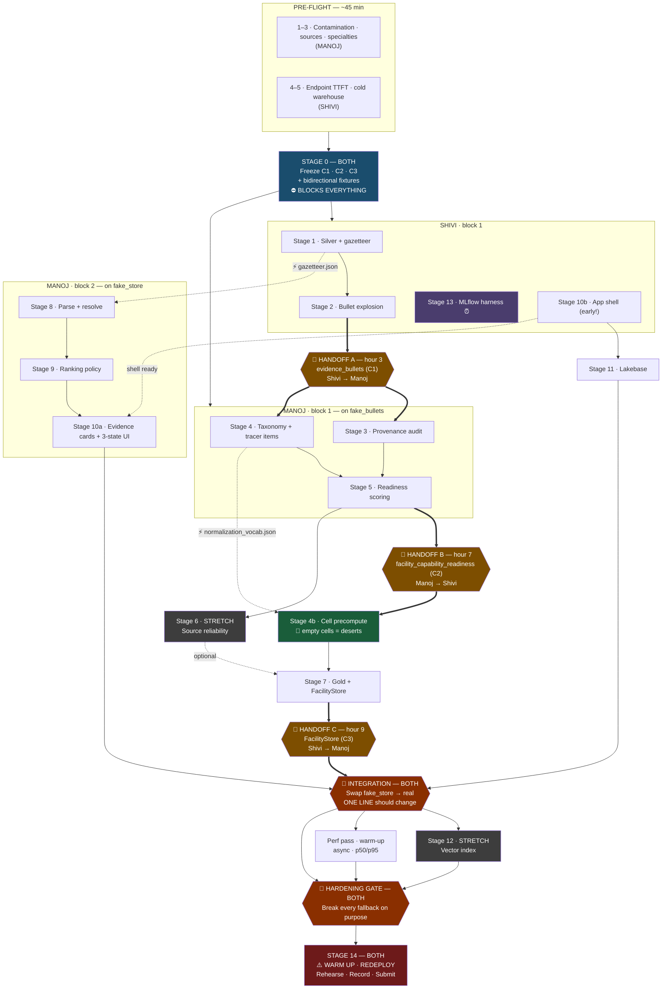

# Indian Healthcare Referral Copilot — Project Brief v3

**Challenge:** Databricks "Data Legend" (Challenge 04), Hack-Nation 6th Global AI Hackathon
**Track:** Indian Healthcare Referral Copilot — *"Where should a patient or coordinator actually go?"*
**Team:** Manoj, solo. *(Shivi is no longer on the project — see §14.5 below. All "Shivi" ownership
tags throughout this document are historical context for design decisions already made, not
live assignments.)*
**Format:** 24-hour sprint. Submission = Git repo + live Databricks App + 1-minute demo.
**Deadline:** Sunday 09:00 ET / 06:00 PT. Finalist pitch round July 25.

> **⚠️ SOLO PIVOT (see §14.5 for the full descoped roadmap).** Shivi's entire execution lane
> (Stages 1, 2, 4b, 6, 7, 10b, 11, 12, 13 as originally scoped) does not have an owner. Stages
> 1 and 2 turned out to be unnecessary as separate work — `facilities_local.parquet` and
> `evidence_bullets.parquet` already satisfy what they would have produced. Stages 4b, 6, 12, 13
> are cut outright (premature optimization or stretch-gated, never required). Stages 7, 9, 10a,
> 10b, 11, 14 are simplified into a single solo-buildable path. **§14.5 is the authoritative plan
> from this point forward — read it before assuming anything below is still the live scope.**

> **v3 changelog.** Rewrote the division of labour. v2 split on *upstream vs downstream*, which
> accidentally put every hard modeling problem in the infrastructure lane. v3 splits on
> **semantic layer vs execution layer** instead. Consequences: three handoffs instead of one,
> **bidirectional fixtures**, Stage 10 split into cards and shell, and a reworked §13 protocol.
>
> *v2 changelog (retained): merged Shivi's systems research — §6 latency architecture, Stage 4b
> cell precompute, N+1 fix in the gold schema, MLflow moved to hour one, 4th pre-flight check.*

> **This document is malleable.** Update the status board in §13 as you go. Commit changes to
> this file like code.

---


## 1. What we are building

A referral coordinator (non-technical, NGO or hospital side) has a patient and a care need.
They enter a location and a need, e.g. *"dialysis near Jaipur"*. They get back a ranked
shortlist of facilities. Each candidate card shows:

- Facility name, city, district, distance — flagged as **exact** or **approximate**
- A verdict for the requested capability, in one of three states:
**corroborated** / **claimed only** / **insufficient evidence**
- The actual evidence sentences from the facility record, grouped by readiness domain,
with the source field named
- The gaps: what is missing, what contradicts, what evidence we *rejected* and why
- Save-to-shortlist

Above the results, one honest region summary with a confidence interval:

> *"14 facilities within 100 km. 3 corroborate dialysis (95% CI 8–48%). 6 claim it with no
> supporting text. 5 have records too thin to judge."*

Shortlists, notes and overrides persist across sessions.

### The line that wins the demo

The challenge brief repeats one idea three times: **do not let a data desert look like a
medical desert.** Our app must visually distinguish "no facilities here", "facilities here but
none evidence this capability", and "we do not know what is here". That distinction is the
single highest-value thing we build.

### Scoring weights (drives every tradeoff)


| Criterion           | Weight | What it means for us                                                  |
| ------------------- | ------ | --------------------------------------------------------------------- |
| Evidence and Trust  | 35%    | Row-level citations, honest uncertainty, self-checking                |
| Product Judgment    | 30%    | Clear non-technical journey, real decision problem                    |
| Technical Execution | 25%    | Works live on Free Edition; Apps / Vector Search / Lakebase used well |
| Ambition            | 10%    | Beyond minimum workflow                                               |


65% of the score is visible on screen. The pipeline exists to serve the cards.

---


## 2. Environment constraints (verified, not assumed)

Databricks **Free Edition** only. No enterprise/paid workspace.


| Capability                            | Status                                                                    | Constraint that affects design                                                                                                                  |
| ------------------------------------- | ------------------------------------------------------------------------- | ----------------------------------------------------------------------------------------------------------------------------------------------- |
| Databricks Apps                       | Works (Dash app already deployed)                                         | Max 3 apps/account. **Apps auto-stop 24h after start/update/redeploy.**                                                                         |
| Vector Search ("AI Search endpoints") | Available                                                                 | 1 endpoint/account, 1 search unit, **Delta Sync mode only** — no Direct Vector Access. **You cannot manually upsert vectors from a batch job.** |
| Lakebase                              | Available                                                                 | 1 project/account, scale-to-zero, Postgres-backed, handles concurrent writes natively.                                                          |
| Model serving                         | Pay-per-token foundation models work                                      | No GPU serving, no provisioned throughput, no custom GPU models, **no batch inference**. Rate limits unpublished.                               |
| Compute                               | Serverless capped, 1 SQL warehouse @ 2X-Small, max 5 concurrent job tasks | A **cold** 2X-Small warehouse can take multiple seconds on first query. See §6.                                                                 |


**Two distinct demo-day failure modes. Both real. Both need handling:**

1. **App auto-stop** after 24h → redeploy immediately before every demo.
2. **Endpoint cold start** — serverless endpoints commonly scale to zero → warm-up routine, and
  ping every few minutes during the session.

**Shared workspace:** both members are in the same Free Edition workspace, so the one Vector
Search endpoint and the one Lakebase project are shared. Design those schemas together, once.

---


## 3. The dataset, and what we found in it

**Source:** Virtue Foundation Dataset (DAIS 2026), 10,088 rows, 51 columns.

### Coverage


| Field           | Coverage |
| --------------- | -------- |
| description     | 100%     |
| capability      | 99.7%    |
| procedure       | 92.5%    |
| equipment       | 77.0%    |
| yearEstablished | 47.8%    |
| numberDoctors   | 36.4%    |
| capacity        | 25.2%    |


**Geography (better than the brief implies):**


| Signal                                       | Count  | %         |
| -------------------------------------------- | ------ | --------- |
| Total rows                                   | 10,088 | —         |
| Rows with lat *and* long                     | 9,970  | **98.8%** |
| has_city / has_state / has_zip / has_country | 10,030 | 99.4%     |


Only ~118 facilities lack coordinates. Geocoding is **not** a major problem for this build.

### Finding 1 — the evidence is already extracted

`capability`, `procedure`, and `equipment` are **JSON arrays of atomic, sentence-level claims**,
not prose. Real examples from row 1:

```
"22-bed Level II Intensive Care Unit (ICU) with 11 ventilator beds"
"Dialysis unit of 20 beds under Pradhan Mantri National Dialysis Programme"
"Dialysis machines: 10"
```

These are already the exact citable sentences the judges asked for. **We do not need an LLM to
find them.** We need to map them to a capability.

**Cost implication.** An LLM pass over 10k records with ~5k tokens of field content each is
~50M tokens against a rate-limited endpoint we cannot benchmark in advance. **Rejected.** Instead:

- Explode the arrays → ~1–1.5M bullet rows. Trivial for Spark.
- Dedupe to distinct bullet strings (many repeat verbatim: "CT scanner", "Blood Bank").
- Match to a taxonomy with regex/keywords. **Minutes, not hours. Re-runnable while tuning.**
- Gold table = 10,077 facilities × 20 capabilities = **201,540 rows, tens of MB.**

**⚠️ Consequence for embeddings:** the embedding unit is `distinct_bullets`**, not facility
descriptions.** Embedding the description throws away the citation granularity that 35% of the
score depends on.

### Finding 2 — the records are contaminated (potentially our headline)

Inspection of sample rows shows evidence from *different facilities* pooled into single rows:

- Row 1: `description` says an Assam government referral hospital. Its `capability` bullets
reference Aravind Eye Hospital (Hyderabad), Madras Medical Mission (Chennai), Janakpuri
Super Speciality and Lok Nayak (Delhi), DDUH.
- Row 3: description is Fortis Anandapur, Kolkata. Bullets are almost entirely Tata Medical Center.
- Row 4: named Wockhardt Nagpur. Carries evidence about Mira Road, Navi Mumbai,
S L Raheja Mumbai, Fortis Mulund.
- Row 5: mixes Rama Medical College Kanpur with Jain Hospital and Bhargava Medical Trauma Centre.

The schema contains `cluster_id`, `source_ids`, `source_content_id` — these rows are
**entity-resolution clusters, and the clustering has over-merged.**

For an Indian Healthcare Referral Copilot this is not cosmetic. It is precisely the harm the brief describes: a
coordinator sends a family to Nagpur for a procedure whose evidence belongs to a hospital in
Mumbai. **A naive app built on this data actively causes the failure the challenge exists to
prevent.**

**We treat evidence provenance as a first-class pillar of trust.** See Stage 3.

### Full column list (51)

```
unique_id, source_types, source_ids, source_content_id, name, organization_type,
content_table_id, phone_numbers, officialPhone, email, websites, officialWebsite,
yearEstablished, acceptsVolunteers, facebookLink, address_line1, address_line2,
address_line3, address_city, address_stateOrRegion, address_zipOrPostcode, address_country,
address_countryCode, countries, facilityTypeId, operatorTypeId, affiliationTypeIds,
description, area, numberDoctors, capacity, specialties, procedure, equipment, capability,
recency_of_page_update, distinct_social_media_presence_count, affiliated_staff_presence,
custom_logo_presence, number_of_facts_about_the_organization,
post_metrics_most_recent_social_media_post_date, post_metrics_post_count,
engagement_metrics_n_followers, engagement_metrics_n_likes, engagement_metrics_n_engagements,
source, coordinates, latitude, longitude, cluster_id, source_urls
```


### Supplementary public datasets

- **India Post PIN Code Directory** (165,627 rows, 19,586 PINs, 750 districts, 37 states).
Grain is **post office, not PIN** — a direct join on `pincode` will fan out. Deduplicate
first. ~12,600 rows have `NA` coordinates.
- **NFHS-5 District Health Indicators** (706 districts × 109 columns). **Out of scope by default.**

---


## 4. Research foundations

We are not inventing methods. Each is an established, citable approach. Naming them in the demo
is itself worth points.

### 4.1 Trust scoring → WHO SARA

WHO's **Service Availability and Readiness Assessment** is the standard instrument for exactly
our question. Service-specific readiness is a facility's ability to offer a specific service,
measured through selected **tracer items** across domains: trained staff, guidelines, equipment,
diagnostic capacity, medicines/commodities. Results are summarized as composite indices — as a
mean across items, or as a **conditional score** where all items for a minimum standard must be met.

"Trust score 0.73" is a hackathon invention. "SARA-style service-specific readiness index across
staff / equipment / diagnostics / procedures domains" is a method healthcare-for-good judges
recognize on sight.

- [https://www.who.int/publications/i/item/WHO-HIS-HSI-2014.5-Rev.1](https://www.who.int/publications/i/item/WHO-HIS-HSI-2014.5-Rev.1)


### 4.2 Tracer items for India → IPHS 2022

Indian Public Health Standards 2022 (MoHFW) specify required services and staff. Every district
hospital must provide HDU, ICU, operation theatre, LDR complex, special newborn care unit and
laboratories. Required specialists include anaesthesiologist, obstetrician/gynaecologist,
paediatrician, orthopaedic specialist, radiologist, ophthalmologist, ENT, psychiatry.

MoHFW's own compliance rule is a **threshold on a composite score: facilities must score ≥80%
to qualify as IPHS compliant** — direct precedent for our banding.

- [https://iphs.mohfw.gov.in/](https://iphs.mohfw.gov.in/)
- [https://nhsrcindia.org/sites/default/files/CHC%20IPHS%202022%20Guidelines%20pdf.pdf](https://nhsrcindia.org/sites/default/files/CHC%20IPHS%202022%20Guidelines%20pdf.pdf)


### 4.3 "No ground truth" → Truth Discovery

A named, solved problem class. Truth-discovery methods integrate multi-source noisy information
by **estimating the reliability of each source in an unsupervised manner, jointly with the truth
itself**, because neither ground truth nor source reliability is known a priori.

We have `source_types`, `source_ids`, `source_urls` per record.

- Li et al., *A Survey on Truth Discovery*, ACM SIGKDD Explorations 17(2), 2016
- CRH (SIGMOD 2014) — [https://cse.buffalo.edu/~jing/doc/sigmod14_crh.pdf](https://cse.buffalo.edu/~jing/doc/sigmod14_crh.pdf)


### 4.4 Contamination → Entity Resolution over-merge detection

Over-clustering is a recognised ER failure mode with unsupervised detection methods. In
graph-based ER, records linked directly or indirectly form clusters via connected components,
and **community detection algorithms refine clusters to avoid over- or under-linking.** One
published approach identifies erroneous links using Louvain community detection, computing an
error degree per link and classifying high-error within-cluster links as false positives.

- [https://dl.acm.org/doi/10.1145/3721985](https://dl.acm.org/doi/10.1145/3721985)


### 4.5 "Prediction intervals" → Wilson score interval

The **Wilson score interval** is the recommended default for binomial proportions: substantially
better coverage than Wald when n is small or p is near 0 or 1, and unlike Wald it always stays
within [0,1].

```
       p̂ + z²/2n ± z·√[ p̂(1−p̂)/n + z²/4n² ]
p̃ =  ─────────────────────────────────────────
                    1 + z²/n
```


### 4.6 Deliberately scoped OUT → 2SFCA

The standard method for medical deserts is the **two-step floating catchment area** family.
2SFCA uses overlapping floating catchments to capture cross-boundary movement and distance
decay, addressing the known weakness of provider-to-population ratios tied to fixed
administrative boundaries. E2SFCA adds a distance-decay function, though there is little
empirical evidence guiding the choice of decay function.

**Right method for the Medical Desert Planner track, not ours.** Say so in the demo.

---


## 5. Architecture

**Spine:** *factor the computation into a part that depends only on the corpus and a part that
depends on the user. The corpus part goes offline. The user part must be cheap.*

Two independent lines of reasoning converged on this: cost avoidance (LLM tokens against a
rate-limited endpoint) and latency budgeting (§6). Worth stating in the demo.

**Offline (re-runnable in minutes):**
`silver_facilities` → `evidence_bullets` → `bullet_provenance_flags` →
`bullet_capability_map` → `facility_capability_readiness` → `gold_facility_capability`
→ `cell_top_facilities` → (optional) AI Search index over `distinct_bullets`

**Online (per query, target 200 ms to first paint):**
deterministic parse → resolve place → cell lookup + vectorized haversine → render → stream

### On "retrieval"

With a fixed taxonomy and a precomputed gold table, candidate generation is a **lookup**, not a
search. **There is no retrieval problem on the main path.**

Vector search earns its place in exactly one situation: a care need outside the taxonomy. We
build the AI Search index over **distinct evidence bullets** and use it purely as the
out-of-taxonomy fallback.

**Rubric resolution.** A pure lookup table is the fastest architecture and might score *badly*
on "used Databricks capabilities well". Resolution: use Vector Search for the open-ended
semantic tail while the common path hits precomputed cells — then **explain the split in the
demo.** *"We routed 90% of queries around the vector index because we measured it wasn't the
bottleneck, and kept it for the tail"* is a stronger technical-execution signal than using every
service uniformly.

---


## 6. Latency and serving architecture


### The hierarchy that is actually ours


| Level                               | Latency     | Ratio vs in-process |
| ----------------------------------- | ----------- | ------------------- |
| In-process dict / numpy array       | ~100 ns     | 1×                  |
| Redis / local cache service         | ~0.5 ms     | 5,000×              |
| Embedding model call                | 50–150 ms   | ~1,000,000×         |
| Delta query (Spark scheduling + S3) | 150–500 ms  | ~2,000,000×         |
| LLM generation call                 | 500–2000 ms | ~10,000,000×        |


The spread is four orders of magnitude wider than GPU land, so moving something up a level is a
10,000× win. And **there is no compute to hide behind** — the CPU is idle in a `read()` syscall.

Options collapse to four: **remove the call, overlap it, precompute it, or hide it perceptually.**

### Naive vs optimized round trip

```
NAIVE (everything in series)
0 ────────── 700 ──────────── 1550 ──────────── 2450 ── 2530 ms
│  LLM parse  │   Retrieve     │  LLM explain    │ render │
                                                          ▲ first useful pixels

OPTIMIZED (fast path + streaming)
0 ─ 165 ─────────────────────────────── 1300 ms
│ ▓ │  explanations streamed in          │
  ▲ first useful pixels
```

Two model calls account for 1.6 s of the naive 2.5 s. The retrieve block is mostly Spark
scheduling overhead plus an N+1 evidence lookup, **not** vector math.

**Amdahl governs.** Optimize the largest span first.

### The five levers


| Lever                 | Applied here                                                                     |
| --------------------- | -------------------------------------------------------------------------------- |
| **Remove**            | Deterministic parse via vocabulary + gazetteer instead of an LLM. 700 ms → ~3 ms |
| **Precompute**        | Cell rankings, embeddings, evidence denormalized into the row                    |
| **Cache**             | Facility array in RAM at startup; capability-vocab embeddings; query memo        |
| **Overlap**           | `asyncio.gather` independent calls: serial 800+800 → max(800, 800)               |
| **Hide perceptually** | Paint the shortlist at ~165 ms, stream justifications behind it                  |


Plus **fast path / slow path**: ~90% of queries match a known capability term and a known city.

### Caches, ranked by actual value

1. **Facility array in process memory at startup.** ~40 MB. Removes 150–500 ms per request. **First.**
2. **Precomputed capability-vocabulary embeddings.** The bridge between precompute and arbitrary
  user input: you cannot precompute for arbitrary text, but you can for the bounded
   intermediate representation that arbitrary text maps onto.
3. **Query-string → embedding memo.** LRU dict for the tail. Warm with demo queries.
4. **Justifications** — see below.

**No TTLs.** The dataset is static this weekend.

### 🔴 Decision: justifications are TEMPLATED, not generated

Precomputing an LLM justification per (facility, capability) is 10,077 × 20 = **201,540 LLM calls** —
the exact cost blowup rejected in §3.

**Better:** the justification is a **format string over the readiness row**, which already carries
per-domain subscores, contradiction flags and completeness.

> *"Matches dialysis on equipment and procedures. No nephrologist evidenced. 2 of 4 domains covered."*

Zero tokens, zero latency, fully reproducible in front of judges. Keep an **optional live LLM
polish on the top 5 only**, behind a fallback.

### Instrumentation is an hour-one task

Instrumented from the start, MLflow tracing shapes decisions. Bolted on at the end it is a demo
prop. One span per stage. Record the **distribution over ~50 runs**, report **p50 and p95**.

**Three measurements worth writing up:**

1. Per-stage latency breakdown
2. Time-to-first-paint vs time-to-complete
3. Cache hit rate and its effect on p95

If we can show **one thing we considered and rejected with data behind the rejection**, that is
the strongest paragraph in the submission.

### Explicitly ruled out


| Ruled out                                   | Why                                                                                                                       |
| ------------------------------------------- | ------------------------------------------------------------------------------------------------------------------------- |
| Embedding quantization                      | 40 MB total. Quantization solves a DRAM-capacity problem at 10⁸–10⁹ vectors. At 10⁴, brute-force cosine is ~2 ms in numpy |
| Kernel work (Triton, torch.compile)         | Requires owning the model executor; we call a hosted endpoint                                                             |
| Distributed compute (NCCL, tensor parallel) | Not present. What *is* present is **distributed composition**: fan-out, tail-latency amplification, timeouts, fallbacks   |
| Query-time batching                         | Exactly one query at serve time. Batching is an *indexing* win only                                                       |


**Tail latency amplification is real:** fan out to 5 services each with p99 = 200 ms and our p99
is *worse* than 200 ms. Timeouts, retries with jitter, and a degraded fallback are mandatory.

---


## 7. Capability layering

Two numbers were in circulation: ~100 vocabulary terms and 20 tracer-scored capabilities.
**Both correct at different layers.** State this explicitly or it surfaces at integration:


| Layer                          | Size       | Purpose                                                                                                                                        |
| ------------------------------ | ---------- | ---------------------------------------------------------------------------------------------------------------------------------------------- |
| **Normalization vocabulary**   | ~100 terms | Maps synonyms ("kidney cleaning", "haemodialysis", "renal replacement") onto a canonical id. Drives the gazetteer parse and the cell key space |
| **Tracer-scored capabilities** | **20**     | Have SARA domains and IPHS-style tracer items defined. These get readiness scores                                                               |
| **Semantic tail**              | unbounded  | Everything the vocabulary misses → vector search over `distinct_bullets`                                                                       |


**Scope discipline: 20 tracer-scored capabilities, now frozen at taxonomy version 2.**
The second set was selected after a corpus-prevalence scan; human-facing display names hide
internal identifiers. No further additions before submission.

---


## 8. Division of labour


### 8.1 The fault line, and why v2 got it wrong

v2 split on **upstream vs downstream of the gold table**. That boundary is architecturally
correct — it is what makes fixture-based parallelism work — but it is not a *skill* boundary.
Splitting on it put every hard modeling problem (entity resolution, taxonomy design, scoring
without labels, unsupervised statistics) into the infrastructure lane, and left gazetteer
lookups, a weighted sum, and Postgres CRUD for the person with the DS/ML background. Inverted.

**v3 splits on semantic layer vs execution layer instead.**


| Layer         | Question it answers                                                                                                | Owner     |
| ------------- | ------------------------------------------------------------------------------------------------------------------ | --------- |
| **Semantic**  | What does this data mean? How do we score it? How do we know we're right with no labels? What do we show the user? | **Manoj** |
| **Execution** | How does it run fast, reliably, instrumented, at volume, deployed?                                                 | **Shivi** |


These two boundaries do **not** coincide. v2 collapsed them.

**Why this matches the people.** Manoj: MS Data Science, RAG and multi-agent systems, production
ML forecasting — the scarcer input here is judgment about evidence and scoring, and the 35%
category *is* that judgment made visible. Shivi: ML systems, architecture, infrastructure,
inference — her research covers memory hierarchy, vLLM internals, TTFT/TPOT, Amdahl, tail
latency. That is deep serving expertise and the exact complement.

### 8.2 The cost, stated honestly

This split has **three handoffs instead of one merge point**. It is a ping-pong rather than two
clean lanes, and that is more coordination on a 12-hour night.

It is acceptable because all three handoffs are **tabular artifacts with schemas frozen at
Stage 0**, not code dependencies. But it requires **bidirectional fixtures** — each person needs
fake versions of what the other will send them, so neither ever idles.

### 8.3 Ownership summary


| Manoj — semantic & evaluation                  | Shivi — execution & serving                     |
| ---------------------------------------------- | ----------------------------------------------- |
| Stage 3 · Provenance audit (ER, Louvain)       | Stage 1 · Silver + gazetteer                    |
| Stage 4 · Taxonomy + SARA tracer items         | Stage 2 · Bullet explosion (1.5M rows)          |
| Stage 5 · Readiness scoring                    | Stage 4b · Cell precompute                      |
| Stage 6 · Source reliability (truth discovery) | Stage 7 · Gold assembly + FacilityStore         |
| Stage 8 · Query parse + resolution             | Stage 10b · App shell, startup, streaming       |
| Stage 9 · Ranking policy                       | Stage 11 · Lakebase persistence                 |
| Stage 10a · Evidence cards + 3-state UI        | Stage 12 · Vector index (Delta Sync)            |
| Wilson intervals / honest-uncertainty layer    | Stage 13 · MLflow harness, warm-up, async, perf |
| Demo script                                    | Stage 14 · Deployment                           |


**On Dash:** neither of you wants it, so split it by layer too. Manoj writes the card components
and the three-state visual language, because that follows directly from the scoring work. Shivi
writes the shell, store loading, streaming plumbing and deploy. **She should ship the shell
early**, so Manoj is only writing components into an already-running app.

---


## 9. Stages


### Stage 0 — Contracts and skeleton **[BOTH]**

**Purpose.** Make parallel work possible. Nothing in the first 90 minutes matters more.

**Three schemas must be frozen here** (v3 has three handoffs, not one):


| Contract                                 | Direction     | Content                                                                                                                                    |
| ---------------------------------------- | ------------- | ------------------------------------------------------------------------------------------------------------------------------------------ |
| **C1 ·** `evidence_bullets`              | Shivi → Manoj | bullet_id, facility_id, source_field, position, text, char offsets                                                                         |
| **C2 ·** `facility_capability_readiness` | Manoj → Shivi | facility_id, capability_id, domain subscores, conditional_pass, completeness, contradiction_flags, supporting bullet_ids, provenance_flags |
| **C3 ·** `FacilityStore` **API**         | Shivi → Manoj | `lookup_cell()`, `get_facility()`, `get_evidence()`, `cell_status()`                                                                       |


**Also commit bidirectional fixtures:**

- `fixtures/fake_bullets.py` → so Manoj can build Stages 3–5 before real bullets land
- `fixtures/fake_readiness.py` → so Shivi can build Stage 7 before real scores land
- `fixtures/fake_store.py` → so Manoj can build Stages 8–10a before the real store exists

**Deliverable.** Merged PR: `contracts.sql`, `store_api.py` (stub), three fixture modules.
**Blocks.** Everything.

---


### Stage 1 — Silver facilities + gazetteer **[Shivi]**

**Purpose.** One clean row per facility with usable geography.
**Method.** Cast `latitude`/`longitude` (98.8% coverage). Normalize `name`, `address_city`,
`address_stateOrRegion`, `address_zipOrPostcode`. Build the PIN/district **gazetteer** from
India Post, deduplicated to one point per PIN and one centroid per district (native grain is
post office, not PIN — a naive join fans out).
**Open question.** The ~118 facilities with no coordinates. **Recommendation: district centroid

- explicit "approximate" flag.** Silent exclusion is exactly the failure the brief punishes.
**Deliverable.** `silver_facilities`, `geo_pin_lookup`, `geo_district_centroids`, `gazetteer.json`.
**⚡ Ship** `gazetteer.json` **to Manoj the moment it exists** — Stage 8 needs it and nothing else.

---


### Stage 2 — Evidence bullet store **[Shivi]** → **HANDOFF A**

**Purpose.** The citation layer. Every receipt the app shows lives here.
**Method.** Explode `capability`, `procedure`, `equipment`, `specialties` from JSON arrays into
one row per bullet with a deterministic `bullet_id`, source field, array position, raw text and
**character offsets**. ~1–1.5M rows. Build a `distinct_bullets` dimension alongside.
**Open question.** Is `specialties` evidence, or a per-bullet label? It appears positionally
aligned with `capability`. **15-minute check** — if the alignment holds it is a free supervised signal.
**Deliverable.** `evidence_bullets`, `distinct_bullets` → **conforming to contract C1**.
**⏰ Critical path.** Manoj works on fixtures until this lands. Target: hour 3.

---


### Stage 3 — Provenance audit **[Manoj]**

**Purpose.** Detect the cross-facility contamination documented in §3 Finding 2.
**Method.** Two passes.

1. *Cheap:* flag any bullet naming a city other than the facility's `address_city`, or an
  organization token not matching the facility `name` — using the dataset's own city and name
   vocabularies as reference lists.
2. *Principled (if time):* within each `cluster_id`, build a bullet similarity graph, run
  Louvain, flag bullets in sub-communities whose name/city profile diverges from the facility's.

**Open question.** Exclude, downweight, or warn? **Recommendation: exclude from scoring but keep
visible in the UI under "evidence we rejected".** Showing rejected evidence is a very strong
trust signal and directly serves the 35% category.
**Deliverable.** `bullet_provenance_flags` + a contamination-rate figure for the demo.
**Note.** Highest-variance, highest-upside item in the build.

**✅ MVP completed.** Audited 451,110 bullets across 10,077 distinct facilities with
GeoNames-normalized explicit-location checks, contextual organization ownership rules, and
long exact-duplicate detection. The conservative detector flagged 1,516 facilities (**15.04%**)
with at least one suspected conflict and put 662 (**6.57%**) into review. This is a detector
flag rate, not verified contamination prevalence. On the biased 25-row development sample it
produced 5 TP / 0 FP / 1 nominal FN; the FN's saved rationale references bullets found in a
different sampled row. Louvain was cut because 9,959 of 9,970 non-null `cluster_id` groups are
singletons and the remaining 11 are duplicate pairs. See `docs/provenance/stage3_findings.md`.

---


### Stage 4 — Capability taxonomy and tracer items **[Manoj]**

**✅ Complete.** The original 10 high-acuity capabilities were expanded to 20 after a
full-corpus prevalence scan. Added: pediatric intensive care, stroke care, neurosurgery,
orthopaedic surgery, respiratory care, gastroenterology/endoscopy, urology, ophthalmology,
diagnostic imaging, and mental health. See `docs/taxonomy/stage4_findings.md`.

The active method is the original **deterministic distinct-bullet mapper**. Executable,
word-bounded include/exclude/context rules live with every tracer in
`capability_taxonomy.yaml`. The local run evaluated all 451,110 bullets as 285,967 exact
distinct strings, then broadcast matches back to bullet IDs. It produced 60,666 match rows
across 55,673 bullets and 6,093 facilities. Exact supporting substrings and matched patterns
are stored for auditability; Stage 3 rejected evidence stays visible with
`exclude_from_scoring=true`.

The attempted full-corpus Databricks LLM classifier is archived under `pipeline/experimental/`
as a measured rejection: approximately 9,533 planned calls, substantial rate limiting/cached
failures, and incomplete coverage. Its partial output and derived Stage 5 metrics are
superseded and must not be reused.

**Purpose.** Make SARA computable against our bullets. The intellectual core.
**Method.** See §7 for the three-layer structure. For each of the **20
tracer-scored** capabilities, define tracer items grouped by SARA domain.
Match by precise regex + keyword rules against `distinct_bullets`, with explicit negative and
context guards for known ambiguity traps.

Worked example — **dialysis**:


| Domain      | Tracer items                                  |
| ----------- | --------------------------------------------- |
| Staff       | nephrologist                                  |
| Equipment   | dialysis machine, ultra-purified water system |
| Procedures  | hemodialysis, peritoneal dialysis             |
| Diagnostics | supporting laboratory                         |


**Validation.** A seeded tracer-stratified sample was generated and inspected once; five
concrete false-positive classes were corrected in one tuning pass. Do not claim population
recall from this bounded precision-oriented sample.
**Deliverable.** `capability_taxonomy.yaml`, `normalization_vocab.json` (~100 terms),
complete `bullet_capability_map`, metrics, and validation sample.
**⚡ Ship** `normalization_vocab.json` **to Shivi early** — Stage 4b's cell key space needs it.

---


### Stage 5 — Readiness scoring **[Manoj]** → **HANDOFF B**

**✅ Complete, revised after two rounds of external second-opinion review.** 201,540 rows = full
10,077-facility × 20-capability cross product (every pair gets an explicit verdict, not just Stage
4 matches — round-1 review catch: rows were originally sparse, contradicting this doc's own "data
desert implemented at row level" principle). Of pairs with ≥1 Stage 4 match (21,324 of them):
20.26% `corroborated`, 79.53% `claimed_only`, 0.20% `insufficient_evidence`. **Conditional-pass rule
recalibrated three times:** (1) from the original 80%-mean/no-zero-domain method — tested against
real data, passed only 0.2% of pairs (calibrated for in-person inspector surveys, not scraped web
text); (2) round-1 catch that `≥2 distinct tracers` alone allows one bullet matching two tracers to
falsely count as corroboration — tightened to `≥2 distinct tracers from ≥2 distinct bullets`; (3)
round-2 catch (independent review) that two bullets can still share one `source_field` (e.g. two
sentences split from the same description text) and aren't genuinely independent either — measured
25.0% of round-1 `corroborated` pairs were exactly this case — tightened again to `≥2 distinct
tracers from ≥2 distinct source fields`. There are now 4,321 `corroborated` pairs across the
expanded taxonomy. Both brief-specified contradiction rules (general surgery w/o OT, ICU w/o
ventilator) implemented — **85.7%** of the 2,656 pairs the rules actually apply to are flagged (an
earlier draft of this line read 49.8% against a denominator — "4,566 applicable rows" — that wasn't
even a real quantity in the current code; round-2 review caught this and it was verified against
real data before correcting). `claimed_only` also does **not** mean "exactly one tracer matched" —
it means usable evidence exists but doesn't clear the corroboration bar; a pair with several tracers
from one bullet or one source field lands here too. See `docs/readiness/stage5_findings.md`.
Conforms to contract C2.

**Purpose.** Per facility, per capability: a defensible verdict with a reason.
**Method (superseded — see above).** SARA composite. Per domain, the fraction of tracer items
evidenced. Overall readiness = mean of domain scores. ~~Report both the mean and the conditional
score (whether every minimum-standard item is met)~~ — conditional score recalibrated, see above.
Layer IPHS-derived consistency rules as contradiction flags (advanced surgery with no
anaesthesia/OT evidence; ICU with no ventilator evidence anywhere).

**Carry completeness separately.** A facility with 2 of 12 fields populated gets *"insufficient
evidence"*, never *"low readiness"*. This is the data-desert / medical-desert distinction
implemented at row level.

**Open question.** Domain weighting. Equal weights to start.
**Deliverable.** `facility_capability_readiness` → **conforming to contract C2**. Target: hour 7.

---


### Stage 6 — Source reliability **[Manoj]** *(stretch, high value)*

**Purpose.** Answer the brief's hardest question with method rather than assertion.
**Method.** Iterative truth discovery. Initialize all sources at equal weight → claim confidence
as a source-weighted vote → recompute source weights from agreement with high-confidence claims
→ iterate to convergence. Three or four iterations of two Spark joins.
**Open question — check early.** Enough *distinct sources per claim* for signal? If most
facilities have one source it degenerates and we cut it. **Five-minute query.**
**Gate.** Only start if Stages 3–5 are done by roughly the 9-hour mark.
**Deliverable.** `source_reliability`, feeding a weight into Stage 5.

---


### Stage 4b — Cell precompute **[Shivi]**

**Purpose.** Turn query-time ranking into a dict lookup.
**Method.** Key space ≈ ~~100 capabilities × ~780 districts ≈ 80,000 cells, most empty. Non-empty
set likely 15–20k. Store **top-50 facilities per cell**, pre-scored on readiness. Query time does
a cell lookup then a vectorized haversine re-rank over the 50 survivors (~~2 ms).
**Depends on:** `normalization_vocab.json` (Stage 4) + `facility_capability_readiness` (Handoff B).
Build against `fake_readiness.py` until B lands.
**🌟 Free bonus.** **Empty cells ARE the medical deserts.** Track 2's deliverable falls out of
Track 3's index — the "multi-track integration" the Ambition criterion asks for.
**⚠️ Critical amendment.** An empty cell is ambiguous in exactly the way the challenge warns.
Three distinct empty cells must be distinguished:

- no facility in the district at all
- facilities present, none evidencing the capability
- facilities present, records too thin to judge

The cell table gives the geometry; **the completeness dimension from Stage 5 makes it honest.**
Do not ship the cell map without it.
**Deliverable.** `cell_top_facilities`, `cell_status`.

---


### Stage 7 — Gold table + FacilityStore **[Shivi]** → **HANDOFF C**

**Purpose.** The artifact the app runs on.
**Method.** Join Stages 1, 3, 5, 6 into facility × capability ≈ 100k rows. Load into a numpy
array + pandas DataFrame at app startup (~40 MB resident, ~zero query cost).

**Schema:**

- readiness index; per-domain subscores; conditional-pass flag
- completeness score; contradiction flags; contamination-adjusted evidence counts
- supporting `bullet_id` array
- **🔴** `top_evidence_text` **— denormalized evidence strings, NOT just IDs.** A `bullet_id` array
alone forces an N+1 lookup measured at ~400 ms. Citation display is on the hot path for every card.
- Wilson interval bounds where applicable

**Deliverable.** `gold_facility_capability` + `FacilityStore` implementing contract C3. Target: hour 9.

---


### Stage 8 — Query understanding and geo resolution **[Manoj]**

**Purpose.** Free text in; structured intent + a point on the map out.
**Method.** Stage 8 is the only active LLM classification path: parse free text to a strict,
schema-validated capability/location object, then resolve vocabulary and place aliases against
`normalization_vocab.json` and the gazetteer. The UI always shows editable parsed fields and
provides a manual deterministic fallback, so a bad parse or slow endpoint never blocks the user.
**Depends on:** `gazetteer.json` (Stage 1, early handoff).
**Open question.** Ambiguous place names. **Recommendation: return top candidates, user picks.**
**Deliverable.** `parse_query()`, `resolve_location()`, with tests.

---


### Stage 9 — Ranking **[Manoj]**

**Purpose.** Order candidates defensibly, in ~2 ms.
**Method.** Cell lookup → vectorized haversine over top-50 survivors → re-rank. Widen to adjacent
districts in bands (50 / 150 / 300 km) when a cell is thin. **User-facing toggle: "nearest" vs
"most evidence"** — a great demo beat, since the list visibly changes. Every card carries a
one-line explanation of its own rank.
**Open question.** Hard-filter low-readiness facilities, or show them ranked lower with a warning?
**Recommendation: show them.** In a genuine desert the honest answer is "the nearest option is
weakly evidenced, here is why" — not an empty list.
**Deliverable.** `rank_candidates()`.

---


### Stage 10a — Evidence cards and uncertainty UI **[Manoj]**

**Purpose.** Where the 35% category is visible.
**Method.** Card components: three-state verdict, evidence grouped by SARA domain, **rejected
evidence shown separately**, gaps stated plainly, region summary with Wilson bounds, three
distinct empty states.
**Open question.** How much SARA framing to expose. **Recommendation: plain language on the card,
method named in a collapsible "how this was scored" panel.**
**Deliverable.** Card components rendering into Shivi's shell.

---


### Stage 10b — App shell, startup and streaming **[Shivi]**

**Purpose.** The runtime Manoj's components live in.
**Method.** Dash app (already proven to deploy). Layout skeleton, `FacilityStore` loading at
startup, routing, streaming contract (paint shortlist at ~165 ms, stream LLM polish behind it),
optional perf panel showing per-stage timings for the last query.
**⚡ Ship the shell early** so Manoj writes components into a running app rather than a vacuum.
**Deliverable.** Deployed app shell with fixture data rendering.

---


### Stage 11 — Persistence **[Shivi]**

**Purpose.** Hard track requirement — work must survive a session.
**Method.** Lakebase Postgres. Tables: `user`, `shortlist`, `shortlist_item` (storing the query
context that produced it), `note`, `override`.
**Open question.** Identity with no real auth. **Timebox: 20 minutes.**
**Deliverable.** DDL + data access layer.

---


### Stage 12 — Vector index fallback **[Shivi]** *(stretch)*

**Purpose.** Handle out-of-taxonomy care needs; demonstrate Vector Search usage.
**Method.** Delta Sync index over `distinct_bullets`. **Delta Sync only — no manual upsert.**
Invoked only when the parse misses the vocabulary. Manoj wires the fallback branch in Stage 8.
**Deliverable.** Index + fallback path. **Nothing on the main path may depend on it.**

---


### Stage 13 — MLflow instrumentation and perf **[Shivi]** *(HOUR ONE)*

**Purpose.** Both the Agentic Traceability stretch goal and our own optimization discipline.
**Method.** One span per stage: parse → resolve → lookup → rank → render → polish.
`time.perf_counter()` per span, 50 runs, report **p50 and p95**. Plus warm-up routine, async
fan-out, cache warming, timeouts and retries with jitter.
**Deliverable.** Trace harness (usable by Manoj from hour one) + the three measurements in §6.

---


### Stage 14 — Deploy, rehearse, ship **[BOTH]**

- [ ] **Warm-up routine run**
- [ ] **Redeploy the app immediately before the demo** (24h auto-stop)
- [ ] One-minute script rehearsed
- [ ] README with architecture diagram + method citations
- [ ] Demo recorded
- [ ] Repo + live app link submitted
- [ ] **Re-verify and redeploy again before July 25**

---


## 10. Pre-flight checks — before anyone writes real code

Four checks. ~45 minutes. **Each can change the shape of the night.**


| #   | Check                                                                  | Owner     | Decides                                               |
| --- | ---------------------------------------------------------------------- | --------- | ----------------------------------------------------- |
| 1   | Contamination rate across 20 random rows                               | **Manoj** | Whether Stage 3 is the headline or a footnote         |
| 2   | Distinct source count per facility                                     | **Manoj** | Whether Stage 6 exists at all                         |
| 3   | `specialties` positional alignment with `capability`                   | **Manoj** | Whether we get a free labelled signal                 |
| 4   | Endpoint benchmark: 20 calls, TTFT, per-token time, idle scale-to-zero | **Shivi** | The entire latency budget                             |
| 5   | Time a cold 2X-Small SQL warehouse query                               | **Shivi** | Whether in-memory loading is mandatory or merely nice |


> Note: checks 1–3 moved to Manoj in v3, since they are diagnostics about *data meaning* and
> they feed directly into the stages he now owns.

---


## 11. Open questions register


| #   | Question                                       | Stage | Owner | Status | Recommendation                                                                                              |
| --- | ---------------------------------------------- | ----- | ----- | ------ | ----------------------------------------------------------------------------------------------------------- |
| Q1  | Contamination rate?                            | 3     | Manoj | ✅      | 15.04% conservative detector flag rate; not true prevalence                                                 |
| Q2  | Enough distinct sources for truth discovery?   | 6     | Manoj | 🔲     | 5-min query                                                                                                 |
| Q3  | Does `specialties` align with `capability`?    | 2     | Manoj | 🔲     | 15-min check                                                                                                |
| Q4  | Regex recall per capability?                   | 4     | Manoj | 🔨     | N/A — pivoted to LLM classification; precision/error-category validation sample pending full-run completion |
| Q5  | ~118 facilities without coordinates            | 1     | Shivi | 🔲     | Centroid + explicit flag                                                                                    |
| Q6  | Contaminated bullets: exclude/downweight/warn? | 3     | Manoj | ✅      | Exclude high-confidence conflicts; retain review; show rejected evidence                                    |
| Q7  | SARA domain weighting                          | 5     | Manoj | 🔲     | Equal weights                                                                                               |
| Q8  | Hard-filter low-readiness candidates?          | 9     | Manoj | 🔲     | Show with warning                                                                                           |
| Q9  | Ambiguous place names                          | 8     | Manoj | 🔲     | User disambiguation click                                                                                   |
| Q10 | How much SARA framing in UI                    | 10a   | Manoj | 🔲     | Plain card + collapsible panel                                                                              |
| Q11 | Session identity model                         | 11    | Shivi | 🔲     | Typed name, 20-min timebox                                                                                  |
| Q12 | Include NFHS-5 district context?               | —     | Both  | 🔲     | Default: cut                                                                                                |
| Q13 | Free Edition batched embedding requests?       | 12    | Shivi | 🔲     | Verify hour one; fallback = chunked concurrent                                                              |
| Q14 | Cold 2X-Small warehouse latency                | 6     | Shivi | 🔲     | Measure hour one                                                                                            |


**Resolved in v2/v3:**

- ~~Justifications precomputed or live?~~ → **Templated from the readiness row. Zero LLM.**
- ~~Is the score a pure function of the facility row?~~ → **Yes, per (facility, capability).**
- ~~Embed facilities or bullets?~~ → `distinct_bullets`**.**
- ~~100 capabilities or 10?~~ → **Both, layered** (§7)
- ~~Delta or in-memory at query time?~~ → **In-memory at startup.**
- ~~Vector search on the main path?~~ → **No. Semantic tail only, and explain the split.**
- ~~Upstream/downstream split?~~ → **No. Semantic/execution split** (§8)

---


## 12. Workflow chart




### Reading the chart

**Solid double arrows (==>) are the three handoffs.** They are the only hard dependencies.

**Dotted arrows (-.->)  are early partial handoffs** — small artifacts shipped the moment they
exist so the other person is unblocked sooner. `gazetteer.json` and `normalization_vocab.json`
cost nothing to ship early and unblock a whole stage each.

**Nobody ever waits.** Before Handoff A, Manoj builds Stages 3–5 against `fake_bullets`. Before
Handoff B, Shivi builds Stage 4b against `fake_readiness`. Before Handoff C, Manoj builds
Stages 8–10a against `fake_store`. **That is the entire purpose of the bidirectional fixtures.**

**The integration test is one line.** If swapping `fake_store` for the real `FacilityStore`
requires more than one import change, contract C3 was violated. Fix the contract, not the app.

---


## 13. Working protocol with Claude Code

> **Living section. Update as you go.**
> Status: 🔲 not started · 🔨 in progress · 🔍 needs review · ✅ done · ⛔ blocked


### 13.1 How we work

- Each person runs **their own Claude Code session** against the shared repo.
- **Branch per stage**: `manoj/stage-4-taxonomy`, `shivi/stage-2-bullets`.
- Never edit files owned by the other lane.
- `contracts.sql` **and** `store_api.py` **are frozen after Stage 0.** Changing them requires both
people present. **This is the one hard rule.**
- Commit this brief's status board with your work so the other person sees progress without asking.


### 13.2 Start now — no dependencies

**Manoj:**

- [ ] 🔲 Pre-flight 1: contamination rate, 20 random rows
- [ ] 🔲 Pre-flight 2: distinct source count per facility
- [ ] 🔲 Pre-flight 3: `specialties` positional alignment
- [ ] 🔲 Draft the one-minute demo script (§14) — **build only what the script needs**

*Claude Code prompt shape:* give it §3 and §4, point it at the Delta table, ask for the three
diagnostic queries plus a summary. Do not let it start building the taxonomy yet.

**Shivi:**

- [ ] 🔲 Pre-flight 4: endpoint benchmark — TTFT, per-token, idle scale-to-zero
- [ ] 🔲 Pre-flight 5: cold 2X-Small warehouse query timing
- [ ] 🔲 Repo skeleton: `/pipeline`, `/app`, `/contracts`, `/fixtures`, `/notebooks`, `/docs`

*Claude Code prompt shape:* give it §2 and §6, ask for a benchmark harness reporting p50/p95
and detecting cold starts.

### 13.3 🔗 Sync 1 — Stage 0 contracts **[~45 min in, both present, ~45 min]**

**Do not skip and do not do async.**

- [ ] 🔲 Review all five pre-flight results together
- [ ] 🔲 Decide Q1, Q2, Q3, Q13, Q14 from what came back
- [ ] 🔲 Write `contracts.sql` — **C1, C2, C3** (§Stage 0)
- [ ] 🔲 Write `store_api.py` — signature only
- [ ] 🔲 Write all three fixture modules
- [ ] 🔲 Merge to `main`. **Freeze.**

**Exit criteria:** Manoj can import `fake_bullets` and `fake_store`; Shivi can import
`fake_readiness`. If any of those fail, do not proceed.

### 13.4 Block 1 **[after Sync 1 → hour 3]**


| Manoj (on `fake_bullets`)         | Status | Shivi                         | Status |
| --------------------------------- | ------ | ----------------------------- | ------ |
| Stage 3 · Provenance audit        | ✅      | Stage 1 · Silver + gazetteer  | 🔲     |
| Stage 4 · Taxonomy + tracer items | ✅      | Stage 2 · Bullet explosion    | 🔲     |
|                                   |        | Stage 13 · MLflow harness     | 🔲     |
|                                   |        | Stage 10b · App shell (early) | 🔲     |


**⚡ Early ships, do not batch these:**

- [ ] 🔲 Shivi → Manoj: `gazetteer.json` (unblocks Stage 8)
- [ ] 🔲 Manoj → Shivi: `normalization_vocab.json` (unblocks Stage 4b key space)
- [ ] 🔲 Shivi → Manoj: app shell running (so cards go into a live app)


### 13.5 🤝 Handoff A — `evidence_bullets` **[~hour 3, 15 min]**

- [ ] 🔲 Shivi ships `evidence_bullets` + `distinct_bullets` conforming to C1
- [ ] 🔲 Manoj swaps `fake_bullets` → real. **One import line.**
- [x] ✅ Stage 3 and complete deterministic Stage 4 map available on real evidence bullets
- [x] ✅ **Decision point:** keep Stage 3 as a concise trust-layer demo beat; report the 15.04% detector flag rate with its limitation


### 13.6 Block 2 **[hour 3 → hour 7]**


| Manoj                                            | Status | Shivi (on `fake_readiness`)    | Status |
| ------------------------------------------------ | ------ | ------------------------------ | ------ |
| Stage 4 · complete taxonomy + bounded validation | ✅      | Stage 4b · Cell precompute     | 🔲     |
| Stage 5 · Readiness scoring                      | ✅      | Stage 11 · Lakebase            | 🔲     |
| Stage 8 · Parse + resolve                        | 🔲     | Stage 10b · streaming contract | 🔲     |


**Review gate:**

- [ ] 🔲 Shivi reviews the taxonomy for *computability* (can this be evaluated at 1.5M-row scale?)
- [ ] 🔲 Manoj reviews the cell_status logic for *honesty* (are the three empty states distinct?)


### 13.7 🤝 Handoff B — `facility_capability_readiness` **[~hour 7, 20 min]**

- [ ] 🔲 Manoj ships readiness table conforming to C2
- [ ] 🔲 Shivi swaps `fake_readiness` → real
- [ ] 🔲 Rebuild cells on real scores; check the empty-cell distribution looks sane
- [ ] 🔲 **Gate check:** are Stages 3–5 done? If yes Manoj starts Stage 6. If no, skip it.


### 13.8 Block 3 **[hour 7 → hour 9]**


| Manoj                                  | Status | Shivi                               | Status |
| -------------------------------------- | ------ | ----------------------------------- | ------ |
| Stage 9 · Ranking policy               | 🔲     | Stage 7 · Gold + FacilityStore      | 🔲     |
| Stage 10a · Evidence cards             | 🔲     | Stage 12 · Vector index *(stretch)* | 🔲     |
| Stage 6 · Source reliability *(gated)* | 🔲     |                                     |        |


### 13.9 🤝 Handoff C + Integration **[~hour 9, both present, ~1.5 hrs]**

The moment the project either works or does not.

- [ ] 🔲 Shivi ships the real `FacilityStore`
- [ ] 🔲 Manoj swaps `fake_store` → real. **One import line.**
- [ ] 🔲 Run 10 real queries end to end
- [ ] 🔲 Three-state verdict renders correctly on real data
- [ ] 🔲 "Evidence we rejected" renders on a genuinely contaminated row
- [ ] 🔲 An empty cell renders as the *correct kind* of empty
- [ ] 🔲 Record p50/p95 for the full path

**If the swap takes more than one line, C3 was violated. Fix the contract, not the app.**

### 13.10 🔗 Hardening gate **[both present]**

Verify every fallback by **actually breaking the thing**:

- [ ] 🔲 LLM endpoint slow/dead → templated justification still renders
- [ ] 🔲 Vector index missing → out-of-taxonomy query degrades gracefully
- [ ] 🔲 Facility missing coordinates → shows "approximate", does not crash
- [ ] 🔲 Empty result set → right desert message, not a blank page
- [ ] 🔲 Lakebase cold → first save does not error
- [ ] 🔲 Timeouts + retries with jitter on every external call


### 13.11 Ship **[both]**

- [ ] 🔲 Warm-up routine run
- [ ] 🔲 **Redeploy the app** (24h auto-stop)
- [ ] 🔲 README with architecture diagram + method citations
- [ ] 🔲 Demo rehearsed against a stopwatch
- [ ] 🔲 Demo recorded
- [ ] 🔲 Repo + live app link submitted
- [ ] 🔲 Calendar reminder: **redeploy again before July 25**


### 13.12 When to wait, and when not to


| Situation                                | Action                                                                                              |
| ---------------------------------------- | --------------------------------------------------------------------------------------------------- |
| Need an artifact that does not exist yet | **Use the fixture.** Never idle.                                                                    |
| Contract needs changing                  | **Stop. Both present.** The one hard rule.                                                          |
| Other lane's handoff is late             | Keep building on fixtures. Do not context-switch into their lane.                                   |
| A stretch item blocks a core item        | **Drop the stretch item.** No discussion needed.                                                    |
| Disagreement on a design call            | Take the §11 recommendation, note the objection, move on. Revisit only if it breaks at integration. |
| Behind at hour 9                         | Cut in order: Stage 6 → Stage 12 → perf panel → streaming → Louvain half of Stage 3                 |


---


## 14. Demo script skeleton (write early, build only what it needs)

1. *The problem* — a coordinator sends a family six hours for an ICU that was a claim, not a capability.
2. *The query* — "dialysis near Jaipur", live. **First paint under 200 ms, visibly.**
3. *The card* — corroborated vs claimed-only vs insufficient evidence; the actual sentences; the gaps.
4. *The differentiator* — "this facility's record contained evidence belonging to a hospital
  400 km away. Here is the evidence we rejected, and why."
5. *The honesty* — region summary with Wilson bounds; **data desert vs medical desert as
  different empty states.**
6. *The method* — SARA readiness domains, IPHS tracer items, unsupervised source reliability.
  No invented scores.
7. *The engineering judgment* — "we routed 90% of queries around the vector index because we
  measured it wasn't the bottleneck. Here's the trace." One thing **rejected with data**.
8. *The persistence* — save to shortlist, refresh, it is still there.

---


## 14.5. Solo descoped roadmap (authoritative — supersedes §8/§9's two-person plan)

**Context.** Shivi left the project after Stage 3/4/5 were already built (by Manoj, solo, with
Claude Code). ~2 hours remain before the 06:00 PT deadline, after which submission/demo prep
starts. Everything below is scoped to what one person can realistically finish, verified, in
that window — not what the original 24-hour two-person plan assumed.

### 14.5.1 Already done, real, tested — the strongest part of the submission

Stage 3 (provenance/contamination audit) → Stage 4 (deterministic capability tagging, 60,666
match rows, 6,093 facilities) → Stage 5 (readiness verdicts, 201,540-row full cross product,
recalibrated against real data, externally reviewed and fixed). All three ship with real
metrics, findings docs, and passing test suites. **This is the entire Evidence & Trust (35%)
story already banked** — row-level citations, honest three-state verdicts, rejected-evidence
visibility, contradiction flags, a documented "we measured a threshold failed and recalibrated"
narrative. Nothing here needs to be touched again except to be *displayed*.

### 14.5.2 Cut outright, with reason (not silently dropped — stated here for the record)

| Stage | Reason for cut |
|---|---|
| Stage 1 (Silver + gazetteer) | Unnecessary — `facilities_local.parquet` already has usable lat/long (98.8%) and address_city; a full PIN gazetteer buys geocoding precision the demo doesn't need. |
| Stage 2 (Bullet explosion) | Already satisfied — Stage 3's `evidence_bullets.parquet` already has bullet_id/source_field/position, C1-shaped. |
| Stage 4b (Cell precompute) | Premature optimization. At 10k facilities, a direct pandas filter + vectorized haversine is milliseconds — no need for a precomputed cell index for a live demo taking one query at a time. |
| Stage 6 (Source reliability / truth discovery) | Brief's own gate: "only start if Stages 3–5 done by hour 9." Explicitly stretch. Time doesn't allow. |
| Stage 12 (Vector index / Delta Sync) | Explicitly stretch; brief's own rule: "nothing on the main path may depend on it." Cut, not missed. |
| Stage 13 (MLflow instrumentation) | Nice for the Agentic Traceability stretch goal, not required for the core rubric. Cut unless time remains after everything else. |
| Louvain refinement (Stage 3) | Already found and documented not to apply — 9,959 of 9,970 `cluster_id` groups are singletons. |

### 14.5.3 The remaining build — bundled into 3 groups, not 6 separate stages

**Group A — Query → Ranked Results (solo-simplified Stages 7 + 8 + 9), ~30 min**
- Deterministic query parse: capability keyword → one of the 10 locked ids (reuse `normalization_vocab.json`); city text → substring match against `facilities_local.parquet.address_city` (no gazetteer needed).
- `FacilityStore`-equivalent: a thin function library over `facility_capability_readiness.parquet` joined to `facilities_local.parquet` (name, city, lat/long) — direct pandas, no precompute.
- Ranking: haversine distance from the resolved city's centroid, re-ranked by verdict quality as a toggle (brief's own "nearest vs most evidence" demo beat).

**Group B — Evidence Cards + App Shell (solo-simplified Stages 10a + 10b), ~35–40 min**
- Single-page Dash app: search form (capability dropdown + city text) → region summary line (count by verdict, Wilson interval) → ranked cards (verdict badge, evidence bullets grouped by domain, rejected evidence shown separately, contradiction flags shown plainly).
- This is where Product Judgment (30%) and the visible half of Evidence & Trust (35%) actually get scored — highest-leverage remaining work.

**Group C — Persistence + Deploy (solo-simplified Stages 11 + 14), ~25–30 min**
- Shortlist save/view, typed-name identity (brief's own recommendation, 20-min timebox), Lakebase if fast to wire up else a simple local persistence fallback — noted honestly in the demo if simplified.
- Deploy to Databricks Apps, redeploy-before-demo reminder, minimal hardening (empty result set → correct desert message; missing coordinates → "approximate", no crash).

**Buffer:** ~20–30 min held back for testing, fixing, and handing off to recording — not scheduled work.

### 14.5.4 Rubric cross-check (Hackathon Prompt.pdf §6, §"Pick Your Mission")

| Criterion | Weight | Covered by |
|---|---|---|
| Evidence and Trust | 35% | Stages 3–5 (done) + Group B's card rendering of what's already computed |
| Product Judgment | 30% | Group B (the actual non-technical journey: search → shortlist → evidence → save) |
| Technical Execution | 25% | Group C (live Databricks App is a hard submission requirement) + Lakebase if time allows |
| Ambition | 10% | The demo narrative itself: LLM→deterministic Stage 4 pivot measured and rejected, 80%→recalibrated threshold with real numbers, external-review fixes — "one thing we considered and rejected with data" is explicitly called out in the brief (§6) as the strongest kind of paragraph to have |

Indian Healthcare Referral Copilot's own minimum workflow (Hackathon Prompt.pdf, "Pick Your Mission" table): *"User
enters a location and care need → receives an evidence-attached shortlist → each candidate shows
distance, matching evidence, and gaps → user saves to a shortlist."* Groups A+B+C are exactly and
only this — nothing scoped beyond the track's own stated minimum, per the brief's own instruction
to "nail the minimum workflow end-to-end," not build all four tracks or every stretch goal.

## 15. Non-negotiables

- **No LLM call on the critical path without a deterministic fallback.**
- **Nothing is silently dropped.** Missing coordinates, thin records and rejected evidence are
all *shown*, never hidden. This is the whole thesis of the submission.
- **Contracts C1/C2/C3 are frozen after Stage 0.** Changing them requires both people present.
- **Never idle waiting for a handoff.** That is what the fixtures are for.
- **Redeploy before every demo.** 24-hour auto-stop.
- **Twenty tracer-scored capabilities.** Taxonomy version 2 is frozen for submission.
- **Free Edition only.**
- **Measure before optimizing.** Amdahl governs.
